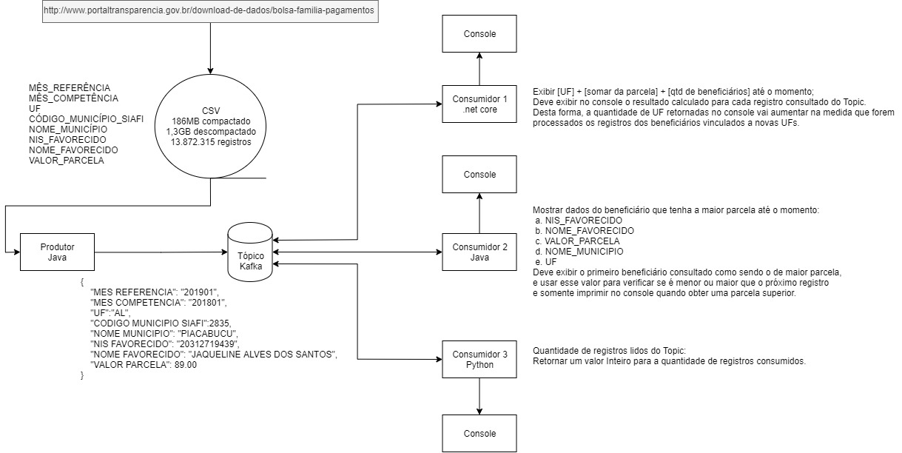
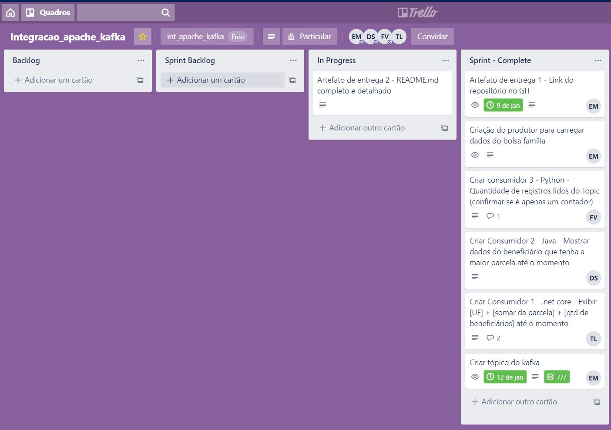
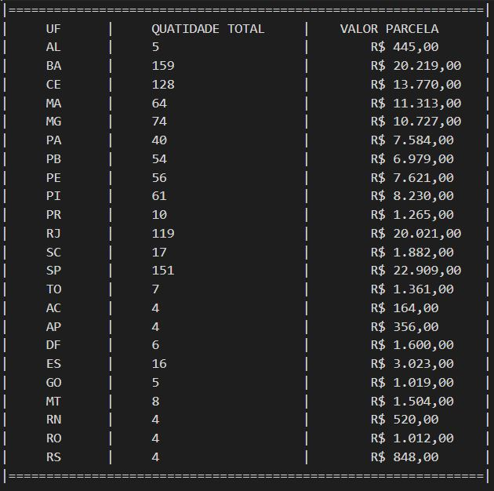
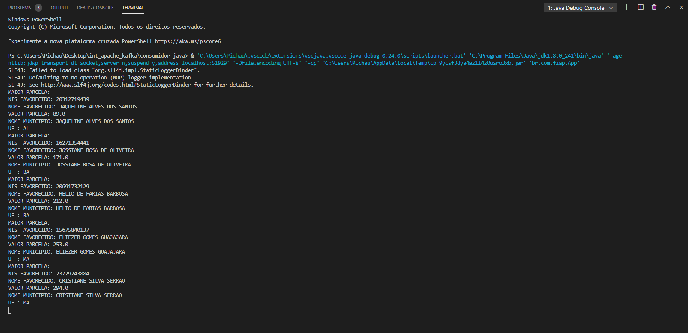
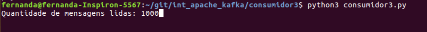

# Implementação - Integração com Apache Kafka
> Trabalho da disciplina de INTEGRATIONS & DEVELOPMENT TOOLS. Construção de um produtor Kafka lendo um arquivo CSV, e 3 produtores consumindo as mensagens, cada um com seu propósito.

## Índice
* [Desenho Macro da Solução](#Desenho%20Macro%20da%20Solução)
* [Atividades do Trello](#Atividades%20do%20Trello)
* [Produtor](#produtor)
* [Consumidor 1](#consumidor%201)
* [Consumidor 2](#consumidor%202)
* [Consumidor 3](#consumidor%203)
* [Integrantes](#integrantes)


## Desenho Macro da Solução


## Atividades do Trello


## Produtor

O produtor tem como objetivo ler um arquivo CSV, para cada linha deste gravar uma mensagem no tópico. Foi desenvolvido em Java.

No projeto do produtor, existe um consumidor, mas este serve apenas para para acompanhamento no desenvolvimento e testes do produtor, não faz parte dos entregáveis do trabalho.

Para montagem do ambiente com o Zookeeper e Kafka utilizar [este](https://towardsdatascience.com/running-zookeeper-kafka-on-windows-10-14fc70dcc771) totorial.

Após Zookeeper e Kafka estarem em funcionamento, criar o tópico Kafka.

```bash
kafka-topics.bat --create --zookeeper localhost:2181 --replication-factor 1 --partitions 1 --topic bolsafamilia2
```
Utilizar o projeto da pasta produtor e executá-lo.

Para solicitar a produção das mensagens, utilizar o Postman, um exemplo da chamada está na pasta postman do projeto.
* O body da requisição é o caminho do arquivo CSV à ser lido.
* Após a execução será exibida a seguinte mensagem:
    * "Arquivo lido e colocado no tópico bolsafamilia"

As mensagens que foram colocadas no tópico poderão ser verificadas no console, pois o consumidor exibe elas.


## Consumidor 1
Tem como objetivo exibir no console o resultado calculado para cada registro consultado do Topic. Desta forma, a quantidade de UF retornadas no console vai aumentar na medida que forem processados os registros dos beneficiários vinculados a novas UFs. 

Foi desenvolvido em .net core. É o projeto na pasta ConsumerKafka

Necessario a configuração do kafka com nome de tópico bolsafamilia2

Resultado da execução com arquivo contendo 10000 registros.



## Consumidor 2
Tem como objetivo mostrar no console a cada registro consultado do tópico, a maior parcela até o momento, com os dados:
* NIS FAVORECIDO 
* NOME FAVORECIDO 
* VALOR PARCELA 
* NOME MUNICIPIO 
* UF  

Resultado da execução com arquivo contendo 10000 registros.


## Consumidor 3
Tem como objetivo contar a quantidade de mensagens do tópico lidas até o momento.

Foi desenvolvido em Python. É o projeto na pasta consumidor3

Instalar kafka-python utilizando pip:
```bash
    $ pip install kafka-python
```
ou
```bash
    $ pip3 install kafka-python
```
Executar script:
```bash
    $ python consumidor3.py
```
ou
```bash
    $ python3 consumidor3.py
```

Resultado da execução com arquivo contendo 10000 registros.


## Integrantes
* Eduardo Matoso
* Bruno Gea
* Diego Smagnotto
* Felipe Silva
* Fernanda Vedovello
* Thiago Langoni
